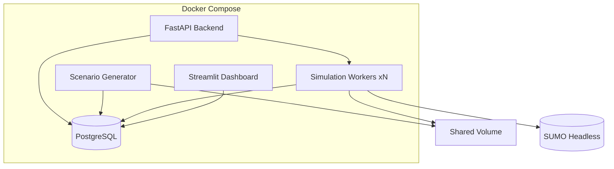

# Sopir - Automated Driving Simulation & Validation Platform

A cloud-native platform for AD/ADAS validation that systematically generates scenarios, executes SUMO simulations, records telemetry, evaluates outcomes, identifies failures, and tracks them against software versions.

**Target Role**: AD/ADAS Software & Data Platform Engineer

---

## Architecture Overview



**Services**: PostgreSQL • FastAPI • Scenario Generator • SUMO Workers (×N) • Streamlit Dashboard

[Full Architecture Documentation →](docs/architecture.md)

---

## Quick Start

### Prerequisites
- Docker Desktop (running)
- Python 3.10+ (for local development, optional - only for the spike below)
- `jq` and `curl`, if you want to drive the API from the shell
- SUMO 1.27+ only if running the TraCI spike locally; the Docker stack bundles it

### End-to-End Verification Run

Walks the whole system and checks each stage actually did something. Follow it in
order - several later steps assume earlier ones produced data.

Every command below is meant for bash (Linux, macOS, or WSL). `jq` is used for
parsing; on Windows, `curl` and `jq` ship separately or run through WSL.

#### Ports and resources

Docker Desktop running, ~4 GB RAM free for 13 services. Ports used: `3000`
(Grafana), `4566` (LocalStack S3), `8000` (API), `8081` (Schema Registry),
`8501` (Dashboard), `9090` (Prometheus), `9092` (Kafka/Redpanda).

```bash
cd sopir
cp .env.example .env   # defaults work locally; edit only if ports clash
```

#### Step 0 - start from clean (optional)

Skip if you have never run this. Required if a previous run left partial state.

`docker compose down -v` alone is **not** enough to reset the raw lake. It drops
the object store but leaves consumer offsets committed, so the writer resumes
where it stopped and you end up with gaps that look like data loss. Reset both:

```bash
docker compose stop lake_writer stream-processor
docker compose rm -f lake_writer stream-processor
docker compose exec redpanda rpk group delete lake-writer
docker compose exec redpanda rpk group delete stream-processor
docker compose exec localstack sh -c "awslocal s3 rm s3://sopir-raw --recursive"
docker compose down -v
```

#### Step 1 - build and start

```bash
docker compose up --build -d
```

**`--build` is not optional.** The images copy the source in at build time and
there is no bind-mount, so a plain `up` runs whatever was last *built* - which
may predate your edits. This is the single most common reason the running system
contradicts the code you are reading. If behaviour looks wrong, rebuild before
investigating anything else.

#### Step 2 - verify the init gate

Three one-shot services prepare the pipeline. **Everything downstream waits on
them**, so if they are not green, nothing after this point means anything:

```bash
docker compose ps -a --format "table {{.Service}}\t{{.Status}}" | grep init
```

Expected - all three `Exited (0)`:

```
SERVICE      STATUS
s3-init      Exited (0)
schema-init  Exited (0)
topic-init   Exited (0)
```

These register the Avro schemas, create the four topics, and create the
versioned bucket. Re-running them is safe and expected: they are idempotent, so
a failure here is a real fault rather than "already done". To see what happened:

```bash
docker compose logs schema-init topic-init s3-init
```

Manual fallback if you ever need to re-run just one:

```bash
docker compose run --rm schema-init
```

#### Step 3 - wait for health

```bash
until curl -fsS http://localhost:8000/healthz >/dev/null 2>&1; do sleep 2; done
echo "backend up"
```

| URL | Shows |
|-----|-------|
| http://localhost:8000/docs | Interactive API docs |
| http://localhost:8501 | Dashboard (Validation / Pipeline tabs) |
| http://localhost:3000 | Grafana, `admin`/`admin` |
| http://localhost:9090/targets | Prometheus scrape targets |

Per-service health, from inside a container:

```bash
docker compose exec lake_writer python -c \
  "import urllib.request; print(urllib.request.urlopen('http://localhost:9101/readyz').read().decode())"
```

#### Step 4 - generate scenarios

```bash
docker compose exec backend python -m scenario_gen.cli generate
curl -s http://localhost:8000/api/v1/scenarios | jq '.items[].type'
```

Expect 4 types - `intersection`, `highway_merge`, `pedestrian_crossing`,
`lane_change`. Zero scenarios means the templates failed validation; check
`docker compose logs backend`.

#### Step 5 - run simulations

```bash
docker compose up --scale worker=3 -d

SCENARIO_IDS=$(curl -s "http://localhost:8000/api/v1/scenarios?page_size=100" | jq -r '.items[].id')
for SID in $SCENARIO_IDS; do
  curl -s -X POST http://localhost:8000/api/v1/runs \
    -H "Content-Type: application/json" \
    -d "{\"scenario_id\": \"$SID\"}" | jq -r '.id'
done
```

Wait on status rather than a fixed sleep - 3 workers on 4 SUMO runs is not a
predictable duration. The loop also exits on `failed`, so a broken run reports
itself instead of hanging the terminal:

```bash
RUN_IDS=$(curl -s "http://localhost:8000/api/v1/runs?page_size=100" \
  | jq -r '.items[] | select(.status=="queued" or .status=="running") | .id')
for RID in $RUN_IDS; do
  while true; do
    STATUS=$(curl -s http://localhost:8000/api/v1/runs/$RID | jq -r .status)
    [ "$STATUS" = "completed" ] && { echo "run $RID completed"; break; }
    [ "$STATUS" = "failed" ]    && { echo "run $RID FAILED"; break; }
    sleep 5
  done
done
```

(`page_size` defaults to 20; raise it or repeat runs will overflow the first page
and you will silently evaluate a subset.)

Then evaluate, which computes metrics and detects failures:

```bash
RUN_IDS=$(curl -s "http://localhost:8000/api/v1/runs?page_size=100" | jq -r '.items[].id')
for RID in $RUN_IDS; do
  curl -s -X POST http://localhost:8000/api/v1/metrics/runs/$RID/evaluate | jq -c '{collision_count, min_ttc, avg_speed}'
done
```

#### Step 6 - send streaming traffic

Phase 1 above wrote telemetry straight to Postgres. Phase 2 routes it through
Kafka. Both paths run side by side by design - the Postgres path is the parity
oracle the streaming path is measured against, so it is kept deliberately.

**Vehicle logs (CAN / GNSS / events):**

```bash
docker compose run --rm vehicle_simulator
```

Defaults are 5 vehicles over 120 s with seed 42, defined in
`vehicle_simulator/simulator.py`. These are *not* in `.env.example` - override on
the command line with `-e VEHICLE_COUNT=...` / `-e SIM_DURATION=...` /
`-e SIM_SEED=...`.

**SUMO telemetry through Kafka:**

```bash
docker compose build worker
docker compose run --rm -e TELEMETRY_SINK=kafka -e PYTHONUNBUFFERED=1 worker
```

Two warnings specific to this step:

- `docker compose run` leaves the worker container **alive and polling** after
  the command returns. A leftover Kafka-sink worker will claim the next queued
  run and starve the Postgres-sink workers. Stop them between runs:
  ```bash
  for c in $(docker ps --filter "name=sopir-worker" -q); do docker stop "$c"; done
  ```
- If the worker image predates `simulation/telemetry_sink.py`, it silently
  ignores `TELEMETRY_SINK` and writes to Postgres. `docker compose build worker`
  first, and confirm with `docker compose logs worker | grep -i sink`.

#### Step 7 - check the reconciliation panel

Open the **Pipeline** tab at http://localhost:8501. It reads four figures
straight from the systems that own them - Kafka watermarks, Parquet row counts,
Postgres row counts, and distinct DLQ keys on the compacted topic. It does not
read Prometheus counters, because those reset on restart and would disagree with
themselves exactly when you are checking whether a restart lost data.

| State | Meaning |
|-------|---------|
| **Balanced** - `produced = landed + dead-lettered` | Correct. Every record is accounted for. |
| **Short** - `produced > landed + dead-lettered` | Real problem. Records went missing; investigate. |
| **Surplus** - `landed > produced` | Benign. A replay re-wrote rows into an append-only lake. |

On the surplus: bronze genuinely duplicates under replay, because object keys
embed the offset range buffered at flush time and a replay re-batches
differently. This is expected and is resolved in silver, where `stream_events`
deduplicates on `event_id`. What bronze guarantees under replay is that no
`event_id` is lost, none is invented, and no payload is rewritten - verified by
`tests/test_pipeline_integration.py`. Only a *shortfall* indicates loss.

```bash
docker compose exec localstack awslocal s3 ls s3://sopir-raw --recursive
docker compose exec db psql -U postgres -d opendrivelab \
  -c "SELECT stream_key, record_count, collision_count FROM stream_metrics;"
```

#### Step 8 - observability

```bash
# Prometheus targets should all be UP
open http://localhost:9090/targets

# Grafana dashboard is provisioned automatically
open http://localhost:3000   # admin/admin
```

Seven alert rules are loaded from `infra/prometheus-rules.yml`. The two worth
knowing: `sopir_dlq_routed_total` is the data-loss counter (every increment is a
record dropped from the happy path), and a flat `time() -
sopir_last_progress_timestamp_seconds` means a consumer is up but stalled.

#### Step 9 - tear down

```bash
docker compose down          # keep volumes
docker compose down -v       # discard all state; see Step 0 before the next run
```

#### Troubleshooting

| Symptom | Cause and fix |
|---------|---------------|
| `UndefinedTableError` on `stream_*` tables | Known race: `stream-processor` waits on `db:service_healthy` but not on `backend`, and the backend's startup `create_all()` is what creates the silver tables. Wait for `backend` to be healthy, then `docker compose restart stream-processor`. |
| Running system contradicts the source | Stale image. `docker compose build <service>`. |
| An `init` service shows `Exited (1)` | Real fault - they are idempotent, so "already exists" is not a failure mode. Read `docker compose logs schema-init topic-init s3-init`. |
| A run is claimed by an unexpected worker | Leftover `docker compose run` worker from the Kafka step. See Step 6 for the cleanup loop. |
| Dashboard shows a surplus | Expected after a replay. Not data loss - see Step 7. |
| `docker compose ps` shows services you stopped | One-shot services stay in `Exited` state by design. `docker compose ps --services --filter status=running` for just the live ones. |
| Looking for the gold layer | Not implemented. The layers that exist are bronze (Parquet in the object store) and silver (Postgres). No gold tier is wired. |

### Local Development Setup

```bash
# Install Python dependencies
pip install -r requirements.txt

# Run SUMO TraCI integration spike (validates SUMO + TraCI)
python spike_sumo.py                    # Minimal generated test
python spike_sumo.py --project /path/to/your/sumo/project  # Your custom project

# Run tests
pytest tests/ -v

# Lint & format
ruff check . && ruff format .
```

---

## SUMO TraCI Integration Spike

Validates that SUMO and TraCI can communicate properly before building the full platform.

### Run Locally (Windows)

```bash
# Minimal generated test (default)
python spike_sumo.py

# Your custom SUMO project
python spike_sumo.py --project "D:\Projects\MySUMOProject"
python spike_sumo.py -p "D:\Projects\MySUMOProject"

# Custom simulation steps
python spike_sumo.py --steps 200
```

### Run in Docker

```bash
# Build image (one-time)
docker build -f Dockerfile.sumo -t sumo-spike .

# Minimal test
docker run --rm sumo-spike

# Your project (volume mount)
docker run --rm -v "D:/Projects/MySUMOProject:/data" sumo-spike --project /data
```

### Expected Output (Success)

```
============================================================
SUMO TraCI Integration Spike
============================================================

[1/5] Creating minimal scenario in /tmp/tmpxxx
    Created: /tmp/tmpxxx/spike.sumocfg

[2/5] Starting SUMO headless via TraCI
    Command: sumo -c /tmp/tmpxxx/spike.sumocfg
    [OK] SUMO started successfully

[3/5] Running simulation loop (100 steps)
    Step   0: ego @ (5.1, 0.0) speed=10.0 lane=edge1_0
    Step  20: ego @ (29.2, 0.0) speed=14.0 lane=edge1_0
    ...

[4/5] Checking results
    Total vehicle readings: ~150
    Unique vehicles seen: {'traffic', 'ego'}
    Collision detection: SKIPPED (TraCI version specific)

[5/5] Shutting down SUMO
    [OK] Clean shutdown

============================================================
SPIKE RESULT: SUCCESS
============================================================
```

---

## Project Structure

```
sopir/
├── docker-compose.yml           # Service orchestration
├── Dockerfile.sumo              # SUMO spike image
├── Dockerfile.backend           # Backend image
├── Dockerfile.worker            # Worker image (SUMO base)
├── Dockerfile.dashboard         # Dashboard image
├── spike_sumo.py                # TraCI integration test
├── requirements.txt             # Python dependencies
├── pyproject.toml               # Ruff config
├── .env.example                 # Environment template
├── .env                         # Local env (gitignored)
├── opencode.json                # AI agent config (permissions, instructions)
├── .opencode/                   # AI agent commands and skills
│   ├── commands/                # Slash commands (/generate-scenarios, ...)
│   └── skills/                  # Domain skills loaded on demand
├── AGENTS.md                    # AI agent guidelines
├── alembic.ini                  # Alembic config
├── alembic/                     # DB migrations
│   ├── env.py
│   ├── script.py.mako
│   └── versions/
│       ├── 0001_initial_schema.py
│       └── 0002_ttc_per_step.py
├── docs/
│   ├── architecture.md          # Architecture documentation
│   ├── SUMO_RESEARCH.md         # SUMO/TraCI research reference
│   ├── PLANNING_phase_1_MVP.md   # MVP roadmap (delivered)
│   ├── PLANNING_phase_2_STREAMING_PIPELINE.md  # Phase 2: streaming ingestion
│   └── AI_CONFIGURATION_PLAN.md # AI agent configuration
├── backend/                     # FastAPI backend
│   ├── main.py                  # App entry point
│   ├── config.py                # Pydantic settings
│   ├── database.py              # SQLAlchemy setup
│   ├── models.py                # ORM models
│   ├── schemas.py               # Pydantic schemas
│   └── api/                     # REST endpoints
│       ├── __init__.py
│       ├── scenarios.py
│       ├── runs.py
│       ├── metrics.py
│       └── failures.py
├── scenario_gen/                # Scenario generator
│   ├── __init__.py
│   ├── cli.py
│   ├── templates/               # .net.xml, .rou.xml, .sumocfg templates
│   │   ├── intersection.net.xml
│   │   ├── intersection.rou.xml
│   │   ├── intersection.sumocfg
│   │   ├── highway_merge.net.xml
│   │   ├── highway_merge.rou.xml
│   │   ├── highway_merge.sumocfg
│   │   ├── pedestrian_crossing.net.xml
│   │   ├── pedestrian_crossing.rou.xml
│   │   ├── pedestrian_crossing.sumocfg
│   │   ├── lane_change.net.xml
│   │   ├── lane_change.rou.xml
│   │   └── lane_change.sumocfg
│   └── nodoc/                   # Template source files
├── simulation/                  # SUMO worker
│   ├── __init__.py
│   ├── worker.py
│   └── traci_client.py
├── evaluation/                  # Metrics & failure detection
│   ├── __init__.py
│   ├── metrics.py
│   └── failure_detector.py
├── dashboard/                   # Streamlit dashboard
│   ├── app.py
│   └── components/
│       ├── __init__.py
│       ├── run_table.py
│       ├── metric_charts.py
│       └── failure_list.py
└── tests/                       # Unit tests
    ├── conftest.py              # Shared fixtures
    ├── test_metrics.py
    ├── test_failure_detector.py
    ├── test_scenario_generation.py
    └── test_evaluate_endpoint.py
```

---

## Scenario Types

| Type | Description | Key Challenge |
|------|-------------|---------------|
| `intersection` | 4-way priority intersection, conflicting left/through traffic | Right-of-way, crossing paths |
| `highway_merge` | 3-lane highway with low-priority on-ramp | Merge gap acceptance |
| `pedestrian_crossing` | Two-lane road with footway and marked crossing | Pedestrian detection, yield |
| `lane_change` | Two congested lanes vs one free lane | Overtake, lane discipline |

---

## Environment Variables

| Variable | Description | Default |
|----------|-------------|---------|
| `DATABASE_URL` | PostgreSQL connection string | `postgresql://postgres:postgres@db:5432/opendrivelab` |
| `SUMO_HOME` | SUMO installation path | Auto-detected |
| `POLL_INTERVAL` | Worker poll interval (seconds) | `5` |
| `TELEMETRY_BATCH_SIZE` | Telemetry batch insert size | `100` |
| `SCENARIO_DATA_DIR` | Shared volume for artifacts | `/data/scenarios` |
| `SCENARIO_TEMPLATES_DIR` | Template directory | `/app/scenario_gen/templates` |

---

## API Endpoints

| Method | Endpoint | Description |
|--------|----------|-------------|
| `POST` | `/api/v1/scenarios/generate` | Generate 4 scenario types |
| `GET` | `/api/v1/scenarios` | List scenarios (paginated) |
| `POST` | `/api/v1/runs` | Create simulation run |
| `GET` | `/api/v1/runs` | List runs (filter by status) |
| `POST` | `/api/v1/runs/{id}/telemetry` | Ingest telemetry batch |
| `PATCH` | `/api/v1/runs/{id}/status` | Update run status |
| `POST` | `/api/v1/metrics/runs/{id}/evaluate` | Compute metrics + detect failures |
| `GET` | `/api/v1/metrics/runs/{id}` | Get metrics for run |
| `GET` | `/api/v1/failures` | List failures (filter by severity/run) |

Interactive API docs: `http://localhost:8000/docs`

---

## Failure Detection Rules

| Severity | Rule | Threshold |
|----------|------|-----------|
| Critical | `collision` | `collision_count > 0` |
| High | `min_ttc_lt_1s` | `min_ttc < 1.0s` |
| Medium | `speed_violations_gt_10` | `speed_violations > 10` |
| Medium | `lane_deviations_gt_5` | `lane_deviations > 5` |

---

## Metrics Computed

| Metric | Description |
|--------|-------------|
| `collision_count` | Vehicle pairs within 2.5m at same timestep |
| `min_ttc` | Minimum time-to-collision across all pairs/steps |
| `avg_speed` | Mean speed across all vehicles/steps |
| `speed_violations` | Timesteps where any vehicle > 15 m/s |
| `lane_deviations` | Lane changes per vehicle |
| `ttc_per_step` | Min TTC per simulation step (for trend chart) |

---

## Development Workflow

```bash
# 1. Make changes
# 2. Run linter
ruff check . && ruff format .

# 3. Run tests
pytest tests/ -v

# 4. Verify manually
docker compose up --build -d
```

---

## Portfolio Talking Points

- **End-to-end validation loop**: Scenario gen → Simulation → Telemetry → Evaluation → Dashboard
- **Failure detection**: TTC thresholds, collision classification, rule violations
- **Cloud-native design**: Docker, async workers, stateless services, shared volumes
- **Engineering metrics**: Not just "it drives" - TTC, violations, lane deviations
- **Scalable architecture**: Horizontal worker scaling, batch telemetry, polling-based job queue

---

## Demo Script (for Interviews)

```bash
# 1. Show architecture diagram in README
# 2. Generate scenarios
docker compose exec backend python -m scenario_gen.cli generate

# 3. Run parallel simulations
docker compose up --scale worker=3 -d

# 4. Show live dashboard
open http://localhost:8501
# - Runs table updating in real-time
# - Failure detection working
# - Metric comparison across scenarios
```

---

## License

MIT License - Portfolio project.