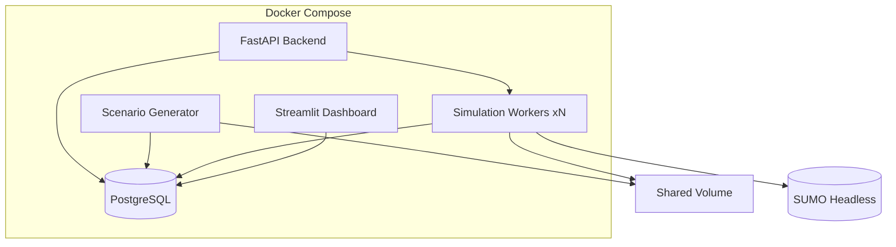

# Sopir - Automated Driving Simulation & Validation Platform

A cloud-native platform for AD/ADAS validation that systematically generates scenarios, executes SUMO simulations, records telemetry, evaluates outcomes, identifies failures, and tracks them against software versions.

**Target Role**: AD/ADAS Software & Data Platform Engineer

---

## Architecture Overview



**Services**: PostgreSQL • FastAPI • Scenario Generator • SUMO Workers (×N) • Streamlit Dashboard

[Full Architecture Documentation →](docs/architecture.md)

---

## Quick Start

### Prerequisites
- Docker Desktop (running)
- Python 3.10+ (for local development)
- SUMO 1.27+ (for local testing)

### Full Platform (Docker Compose)

```bash
# 1. Clone and setup
cd sopir
cp .env.example .env  # Edit if needed

# 2. Start all services
docker compose up --build -d

# 3. Generate scenarios (creates 4 scenario types)
docker compose exec backend python -m scenario_gen.cli generate

# 4. Start workers (scale for parallel simulation)
docker compose up --scale worker=3 -d

# 5. Create simulation runs (one per scenario type)
SCENARIO_IDS=$(curl -s http://localhost:8000/api/v1/scenarios | jq -r '.items[].id')
for SID in $SCENARIO_IDS; do
  curl -X POST http://localhost:8000/api/v1/runs \
    -H "Content-Type: application/json" \
    -d "{\"scenario_id\": \"$SID\"}"
done

# 6. Wait 30-60s for workers to complete, then evaluate all runs
RUN_IDS=$(curl -s http://localhost:8000/api/v1/runs | jq -r '.items[].id')
for RID in $RUN_IDS; do
  curl -X POST http://localhost:8000/api/v1/metrics/runs/$RID/evaluate
done

# 7. Open dashboard
open http://localhost:8501
```

### Local Development Setup

```bash
# Install Python dependencies
pip install -r requirements.txt

# Run SUMO TraCI integration spike (validates SUMO + TraCI)
python spike_sumo.py                    # Minimal generated test
python spike_sumo.py --project /path/to/your/sumo/project  # Your custom project

# Run tests
pytest tests/ -v

# Lint & format
ruff check . && ruff format .
```

---

## SUMO TraCI Integration Spike

Validates that SUMO and TraCI can communicate properly before building the full platform.

### Run Locally (Windows)

```bash
# Minimal generated test (default)
python spike_sumo.py

# Your custom SUMO project
python spike_sumo.py --project "D:\Projects\MySUMOProject"
python spike_sumo.py -p "D:\Projects\MySUMOProject"

# Custom simulation steps
python spike_sumo.py --steps 200
```

### Run in Docker

```bash
# Build image (one-time)
docker build -f Dockerfile.sumo -t sumo-spike .

# Minimal test
docker run --rm sumo-spike

# Your project (volume mount)
docker run --rm -v "D:/Projects/MySUMOProject:/data" sumo-spike --project /data
```

### Expected Output (Success)

```
============================================================
SUMO TraCI Integration Spike
============================================================

[1/5] Creating minimal scenario in /tmp/tmpxxx
    Created: /tmp/tmpxxx/spike.sumocfg

[2/5] Starting SUMO headless via TraCI
    Command: sumo -c /tmp/tmpxxx/spike.sumocfg
    [OK] SUMO started successfully

[3/5] Running simulation loop (100 steps)
    Step   0: ego @ (5.1, 0.0) speed=10.0 lane=edge1_0
    Step  20: ego @ (29.2, 0.0) speed=14.0 lane=edge1_0
    ...

[4/5] Checking results
    Total vehicle readings: ~150
    Unique vehicles seen: {'traffic', 'ego'}
    Collision detection: SKIPPED (TraCI version specific)

[5/5] Shutting down SUMO
    [OK] Clean shutdown

============================================================
SPIKE RESULT: SUCCESS
============================================================
```

---

## Project Structure

```
sopir/
├── docker-compose.yml           # Service orchestration
├── Dockerfile.sumo              # SUMO spike image
├── Dockerfile.backend           # Backend image
├── Dockerfile.worker            # Worker image (SUMO base)
├── Dockerfile.dashboard         # Dashboard image
├── spike_sumo.py                # TraCI integration test
├── requirements.txt             # Python dependencies
├── pyproject.toml               # Ruff config
├── .env.example                 # Environment template
├── .env                         # Local env (gitignored)
├── PLANNING.md                  # Implementation roadmap
├── AGENTS.md                    # AI agent guidelines
├── alembic.ini                  # Alembic config
├── alembic/                     # DB migrations
│   ├── env.py
│   ├── script.py.mako
│   └── versions/
│       ├── 0001_initial_schema.py
│       └── 0002_ttc_per_step.py
├── docs/
│   └── architecture.md          # Architecture documentation
├── backend/                     # FastAPI backend
│   ├── main.py                  # App entry point
│   ├── config.py                # Pydantic settings
│   ├── database.py              # SQLAlchemy setup
│   ├── models.py                # ORM models
│   ├── schemas.py               # Pydantic schemas
│   └── api/                     # REST endpoints
│       ├── __init__.py
│       ├── scenarios.py
│       ├── runs.py
│       ├── metrics.py
│       └── failures.py
├── scenario_gen/                # Scenario generator
│   ├── __init__.py
│   ├── cli.py
│   ├── templates/               # .net.xml, .rou.xml, .sumocfg templates
│   │   ├── intersection.net.xml
│   │   ├── intersection.rou.xml
│   │   ├── intersection.sumocfg
│   │   ├── highway_merge.net.xml
│   │   ├── highway_merge.rou.xml
│   │   ├── highway_merge.sumocfg
│   │   ├── pedestrian_crossing.net.xml
│   │   ├── pedestrian_crossing.rou.xml
│   │   ├── pedestrian_crossing.sumocfg
│   │   ├── lane_change.net.xml
│   │   ├── lane_change.rou.xml
│   │   └── lane_change.sumocfg
│   └── nodoc/                   # Template source files
├── simulation/                  # SUMO worker
│   ├── __init__.py
│   ├── worker.py
│   ├── traci_client.py
│   └── telemetry.py
├── evaluation/                  # Metrics & failure detection
│   ├── __init__.py
│   ├── metrics.py
│   └── failure_detector.py
├── dashboard/                   # Streamlit dashboard
│   ├── app.py
│   └── components/
│       ├── __init__.py
│       ├── run_table.py
│       ├── metric_charts.py
│       └── failure_list.py
└── tests/                       # Unit tests
    ├── __init__.py
    ├── conftest.py              # Shared fixtures
    ├── test_metrics.py
    ├── test_failure_detector.py
    ├── test_scenario_generation.py
    └── test_evaluate_endpoint.py
```

---

## Scenario Types

| Type | Description | Key Challenge |
|------|-------------|---------------|
| `intersection` | 4-way priority intersection, conflicting left/through traffic | Right-of-way, crossing paths |
| `highway_merge` | 3-lane highway with low-priority on-ramp | Merge gap acceptance |
| `pedestrian_crossing` | Two-lane road with footway and marked crossing | Pedestrian detection, yield |
| `lane_change` | Two congested lanes vs one free lane | Overtake, lane discipline |

---

## Environment Variables

| Variable | Description | Default |
|----------|-------------|---------|
| `DATABASE_URL` | PostgreSQL connection string | `postgresql://postgres:postgres@db:5432/opendrivelab` |
| `SUMO_HOME` | SUMO installation path | Auto-detected |
| `POLL_INTERVAL` | Worker poll interval (seconds) | `5` |
| `TELEMETRY_BATCH_SIZE` | Telemetry batch insert size | `100` |
| `SCENARIO_DATA_DIR` | Shared volume for artifacts | `/data/scenarios` |
| `SCENARIO_TEMPLATES_DIR` | Template directory | `/app/scenario_gen/templates` |

---

## API Endpoints

| Method | Endpoint | Description |
|--------|----------|-------------|
| `POST` | `/api/v1/scenarios/generate` | Generate 4 scenario types |
| `GET` | `/api/v1/scenarios` | List scenarios (paginated) |
| `POST` | `/api/v1/runs` | Create simulation run |
| `GET` | `/api/v1/runs` | List runs (filter by status) |
| `POST` | `/api/v1/runs/{id}/telemetry` | Ingest telemetry batch |
| `PATCH` | `/api/v1/runs/{id}/status` | Update run status |
| `POST` | `/api/v1/metrics/runs/{id}/evaluate` | Compute metrics + detect failures |
| `GET` | `/api/v1/metrics/runs/{id}` | Get metrics for run |
| `GET` | `/api/v1/failures` | List failures (filter by severity/run) |

Interactive API docs: `http://localhost:8000/docs`

---

## Failure Detection Rules

| Severity | Rule | Threshold |
|----------|------|-----------|
| Critical | `collision` | `collision_count > 0` |
| High | `min_ttc_lt_1s` | `min_ttc < 1.0s` |
| Medium | `speed_violations_gt_10` | `speed_violations > 10` |
| Medium | `lane_deviations_gt_5` | `lane_deviations > 5` |

---

## Metrics Computed

| Metric | Description |
|--------|-------------|
| `collision_count` | Vehicle pairs within 2.5m at same timestep |
| `min_ttc` | Minimum time-to-collision across all pairs/steps |
| `avg_speed` | Mean speed across all vehicles/steps |
| `speed_violations` | Timesteps where any vehicle > 15 m/s |
| `lane_deviations` | Lane changes per vehicle |
| `ttc_per_step` | Min TTC per simulation step (for trend chart) |

---

## Development Workflow

```bash
# 1. Make changes
# 2. Run linter
ruff check . && ruff format .

# 3. Run tests
pytest tests/ -v

# 4. Verify manually
docker compose up --build -d
```

---

## Portfolio Talking Points

- **End-to-end validation loop**: Scenario gen → Simulation → Telemetry → Evaluation → Dashboard
- **Failure detection**: TTC thresholds, collision classification, rule violations
- **Cloud-native design**: Docker, async workers, stateless services, shared volumes
- **Engineering metrics**: Not just "it drives" - TTC, violations, lane deviations
- **Scalable architecture**: Horizontal worker scaling, batch telemetry, polling-based job queue

---

## Demo Script (for Interviews)

```bash
# 1. Show architecture diagram in README
# 2. Generate scenarios
docker compose exec backend python -m scenario_gen.cli generate

# 3. Run parallel simulations
docker compose up --scale worker=3 -d

# 4. Show live dashboard
open http://localhost:8501
# - Runs table updating in real-time
# - Failure detection working
# - Metric comparison across scenarios
```

---

## License

MIT License - Portfolio project.