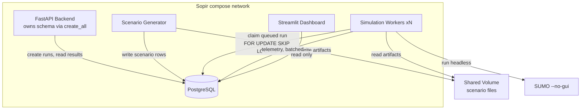
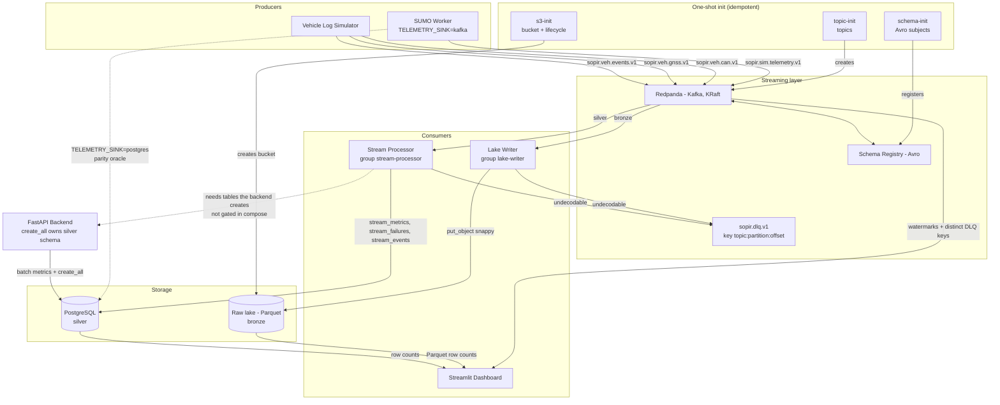
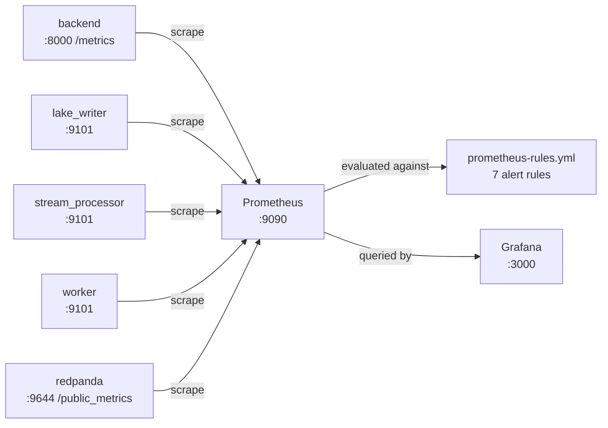
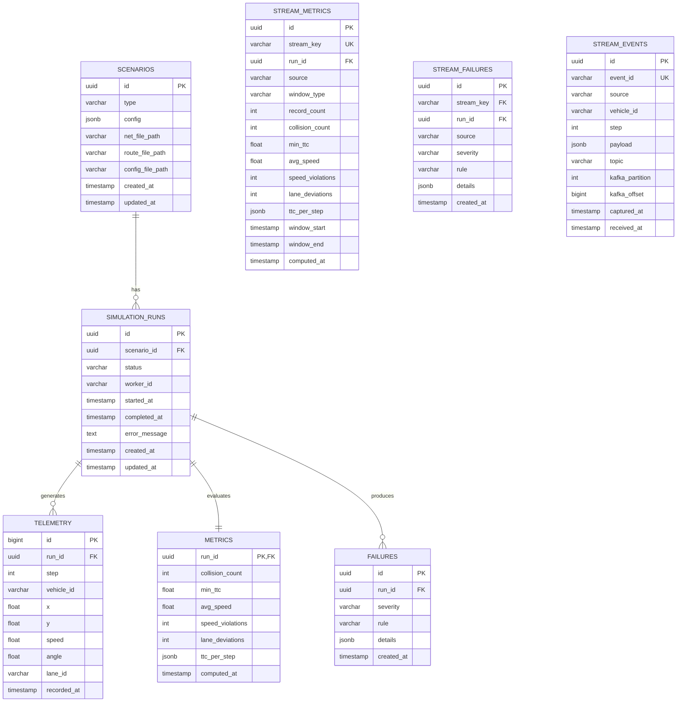

# Sopir Architecture

Two layers, deliberately separated:

- **Phase 1 — validation loop**: scenarios → SUMO → telemetry → metrics/failures → dashboard.
  Direct, synchronous, easy to reason about.
- **Phase 2 — streaming platform**: producers → Kafka → raw lake (bronze) and,
  next, stream processing (silver). Multiple heterogeneous sources, replayable.

## System Overview

### Validation Loop (Phase 1)



Two things this diagram deliberately does not show.

**There is no API-to-worker edge.** The backend never calls a worker. It
writes a `queued` row and the worker has already polled for it; see the claim
query in section 2. An arrow between them would imply a control channel that
does not exist, and "why is there no push API" is a fair interview question
that the polling design answers better than a diagram would.

**SUMO is a child process, not a peer service.** It is drawn as a node only
because it is the thing being measured; it shares no network with the rest of
the stack.

### Streaming Platform (Phase 2)



**There is deliberately no lake-to-processor edge.** The processor consumes
Kafka only; `boto3` appears in `streaming/lake_writer.py` and nowhere else, so
no code path reads the lake back. "Rebuild silver from bronze" is a property
the layout makes *possible* (Avro in, Hive-partitioned Parquet out, topics
retained), not a pipeline that is wired today. An earlier draft of this diagram
drew that edge, which was aspirational rather than descriptive.

**Two dotted edges carry real meaning.** The worker's `postgres` sink is a
deliberate second path, not a leftover; it is the oracle the parity harness
measures the streamed path against, and both paths call the same pure
functions in `evaluation/`. The processor-to-backend edge is the one *gap*: the
processor needs the silver tables, which the backend creates at startup, and
`docker-compose.yml` gates the processor on `db` but not on `backend`. See
[Local Development](#local-development) for the consequence and the workaround.

Layered the way a real data platform is layered: **bronze** (raw, immutable,
as-received) in the object store; **silver** (cleaned, aggregated) in PostgreSQL.

## Services

### Phase 1

| Service | Technology | Responsibility | Scale |
|---------|------------|----------------|-------|
| **Backend (API)** | FastAPI + SQLAlchemy | REST API, job queue, results storage | 1 (stateless) |
| **Scenario Generator** | Python + Jinja2 templates | Generate SUMO artifacts from templates | Batch/on-demand |
| **Simulation Workers** | Python + TraCI + SUMO | Run headless SUMO, emit telemetry | Horizontal (N) |
| **Evaluation Engine** | Python | Compute metrics, detect failures | On-demand |
| **Dashboard** | Streamlit | Visualize runs, metrics, failures | 1 |
| **PostgreSQL** | Postgres 16 | Persistent storage for all data | 1 |

### Phase 2

| Service | Technology | Responsibility | Scale |
|---------|------------|----------------|-------|
| **Redpanda** | Redpanda (KRaft) | Stream buffer, one topic per source type | 1 locally; partitioned in prod |
| **Schema Registry** | Redpanda Schema Registry | Avro contract enforcement, `BACKWARD` compatibility | Bundled with Redpanda |
| **Vehicle Log Simulator** | Python | Synthetic CAN + GNSS + event streams, seeded RNG | 1 (test data source) |
| **Lake Writer** | Python + `confluent-kafka` + PyArrow | Consumer group: Avro → Parquet → S3, then commits offsets | Horizontal (N) |
| **Object Store** | LocalStack (S3 API) | Raw lake, versioned, 30-day expiry | 1 locally |
| **Prometheus** | Prometheus | Scrapes `/metrics` from every service | 1 locally |
| **Grafana** | Grafana 11 | Provisioned pipeline dashboard: health, lag, throughput, DLQ | 1 locally |
| **Stream Processor** | Python + `confluent-kafka` | Windowed aggregation → metrics/failures in silver tables | Horizontal (N) |


## Data Flow

### 1. Scenario Generation
```
POST /api/v1/scenarios/generate
    → scenario_gen.cli.generate_scenarios()
    → For each of 4 types (intersection, highway_merge, pedestrian_crossing, lane_change):
        - Load template .net.xml, .rou.xml from scenario_gen/templates/
        - Validate XML structure (lanes have shapes, routes have vehicles)
        - Create scenario row in DB with UUID
        - Write artifacts to /data/scenarios/{scenario_id}/
    → Returns 4 scenario IDs
```

### 2. Simulation Execution
```
POST /api/v1/runs {"scenario_id": "..."}
    → Creates SimulationRun(status="queued")
    → Worker polls DB for queued runs (SELECT ... FOR UPDATE SKIP LOCKED)
    → Worker claims run (status="running", worker_id=HOSTNAME)
    → TraCI context manager starts SUMO headless with .sumocfg
    → Simulation loop:
        - traci.simulationStep()
        - Read all vehicle positions, speeds, lanes
        - Batch telemetry every 100 steps → bulk INSERT
    → On completion: status="completed", write remaining telemetry
    → On error: status="failed", error_message set
```

### 3. Evaluation
```
POST /api/v1/metrics/runs/{run_id}/evaluate
    → Fetch all telemetry for run_id (ordered by step, vehicle_id)
    → compute_metrics(telemetry) → dict with 6 metrics + ttc_per_step
    → detect_failures(metrics) → list of failure dicts
    → Upsert Metrics row (run_id PK)
    → Delete old failures for run, insert new failures
    → Commit (does NOT touch run.status - worker owns lifecycle)
    → Returns MetricsResponse
```

### 4. Dashboard Visualization
```
GET / (Streamlit)
    → Load runs, metrics, failures, scenarios (cached 30s)
    → Render:
        - Runs table with filters (status, scenario, date)
        - Metric charts (bar charts, TTC trend line)
        - Failure list with severity/rule filters
```

### 5. Stream Ingestion

Both producers write to Kafka through the same `streaming/producer.py`
wrapper, so schema registration, serialisation, and delivery handling live in
exactly one place.

```
Producer (worker or vehicle_simulator)
    → streaming/producer.py
        - Lazily fetch AvroSchema for subject (latest version, cached per topic)
        - build_producer() sets:
            security.protocol, bootstrap.servers, schema.registry.url,
            enable.idempotence=true, acks=all, compression=snappy
    → Confluent AvroSerializer attaches a 5-byte magic header + schema ID
    → Kafka
```

| Topic | Schema subject | Produced by | Partition key |
|-------|----------------|-------------|---------------|
| `sopir.sim.telemetry.v1` | `sopir.sim.telemetry-value` | Simulation worker (`TELEMETRY_SINK=kafka`) | `run_id` |
| `sopir.veh.can.v1` | `sopir.veh.can-value` | Vehicle simulator | `vehicle_id` |
| `sopir.veh.gnss.v1` | `sopir.veh.gnss-value` | Vehicle simulator | `vehicle_id` |
| `sopir.veh.events.v1` | `sopir.veh.events-value` | Vehicle simulator | `vehicle_id` |
| `sopir.dlq.v1` | `sopir.dlq-value` | Lake writer (dead letters) | `topic:partition:offset` |

Partitioning by `run_id` / `vehicle_id` keeps one vehicle's records ordered and
co-located, which matters for windowing in Phase 2.4.

### 6. Raw Lake Write (Bronze Layer)

```
Lake Writer (consumer group "lake-writer")
    → Subscribe to 4 source topics
    → Poll up to 500 msgs (poll timeout 1s)
    → For each message:
        - AvroDeserializer (latest schema) → dict
        - Validate required envelope fields + integer captured_at
          - on failure → DLQ, then commit offset
        - Append to per-(topic, partition) pending buffer
    → Flush trigger: 200 records OR 5s elapsed
    → _flush_one(topic, partition):
        1. Group buffered records by UTC event hour
        2. For each hour group:
source=/dt=/hour=
              s3://sopir-raw/source=<s>/dt=<YYYY-MM-DD>/hour=<HH>/
                part-<p>-<first>-<last>.parquet
              Build PyArrow table + source/dt/hour columns
              put_object(compression="snappy")
        3. consumer.store_offsets(last_offset + 1)
        4. consumer.commit()
```

**The ordering in `_flush_one` is the whole correctness story: the S3 write
happens strictly before the offset commit.** If the writer dies in between, the
batch replays rather than disappearing.

**What replay does is *not* free.** The object key embeds the offset range that
was buffered when the flush fired, and that range is a function of timing, not
of the data: `LAKE_BATCH_SIZE` and `LAKE_FLUSH_INTERVAL_SEC` can split the same
records differently on a second pass. The replay therefore writes a *new* key
and the records land twice. This was measured rather than assumed — a full
replay under a fresh consumer group took the lake from 520 rows to 1040.

Bronze is append-only, so duplication is tolerated by design and resolved in
silver. The guarantee that actually holds, and that `tests/test_pipeline_integration.py`
asserts, is:

```
a replay adds rows, never loses them, never invents an event_id,
and never changes the payload behind one
```

That is what makes `event_id` safe to dedupe on. If deterministic batching is
ever wanted — flushing only on offset-aligned strides — the partial trailing
chunk of each partition would then never flush, because Kafka has no
end-of-stream marker. That trade-off was considered and rejected.

### 7. Stream Processing (Silver Layer)

```
Consumer group: stream-processor  (independent of lake-writer)
    → Consume sopir.sim.telemetry.v1 + 3 vehicle topics
    → Route by topic:
        sim.telemetry  → run-keyed window, keyed by run_id
        veh.*          → stream_events, no scoring (no geometry)
    → Window lifecycle (streaming/windowing.py):
        - Run window closes on idle timeout (default 30s), not on run_ended
          (no run_ended marker exists yet, so idle is the only signal)
        - Records accumulate in memory until the window closes
    → On close:
        1. to_telemetry() projects the window back to the metric input shape
        2. compute_metrics(telemetry)      ← same pure function as batch
        3. detect_failures(metrics)       ← same pure function as batch
        4. SilverWriter upserts on ON CONFLICT (stream_key) DO NOTHING
        5. THEN commit the window's offsets
    → On any per-record failure → DLQ, commit that offset, keep serving
```

The processor deliberately reuses `evaluation/` verbatim. That is what makes
parity a meaningful test rather than a tautology: both paths call the same pure
functions, so any disagreement must come from the stream adapter — a dropped
record, a mis-projected field, or a window that closed early.

**Offsets are tracked per window, not globally.** An earlier version shared one
pending-offset map across all topics, so flushing a vehicle-event batch could
commit past sim records still sitting in an open window, silently skipping them.
Simulation offsets and vehicle offsets are now kept separate, and each window
commits only the offsets it actually covers.

### 8. Dead Letter Handling

```
Undecodable record
    → dlq.route(topic, partition, offset, stage="deserialization", reason)
    → DLQEnvelope Avro record to sopir.dlq.v1
        - original_value: raw payload, base64-encoded (never discarded)
        - error_stage / error_reason / consumer_group / source location
    → Then, and only then, commit the source offset
```

Two properties matter:

- **The raw bytes are preserved.** A malformed record is debuggable; you do not
  have to go back to the producer to find out what went wrong.
- **The key is `topic:partition:offset`.** Every retry of the same bad record
  lands on the same key, so the DLQ topic's compaction collapses repeats into
  one entry instead of accumulating duplicates.

## Observability

Every service answers the same three questions the same way:

| Endpoint | Question | Failure means |
|----------|----------|---------------|
| `/healthz` | Is the main loop still turning? | Restart the container |
| `/readyz`  | Are the dependencies reachable? | Take it out of rotation |
| `/metrics` | What is it doing and how fast? | Investigate |

Liveness is driven by an explicit heartbeat from the main loop rather than by
process-alive, because a consumer blocked on a broker socket stays alive while
doing nothing. The heartbeat fires **every loop iteration, including when no
records arrive**: an idle consumer is healthy and waiting, and tying liveness to
traffic produces false alarms the moment a topic goes quiet.

Readiness is driven by named dependency checks. The lake writer probes the
bucket, the processor and worker probe Postgres, the backend probes the
database on `/readyz` with a 5-second cache so a readiness probe under load
cannot become the outage.

| Service | Metrics port | Readiness check |
|---------|--------------|-----------------|
| backend | 8000 (FastAPI) | `SELECT 1` against Postgres |
| lake_writer | 9101 | bucket exists and is writable |
| stream_processor | 9101 | Postgres reachable |
| worker | 9101 | Postgres reachable |



Daemon metrics ports are deliberately not published to the host. Prometheus
reaches them over the compose network, which is the same path service discovery
would use against ECS. Grafana is on `:3000` (`admin`/`admin`) and Prometheus
on `:9090`.

### Metrics

All services register the same names, so one query covers the pipeline. Labels
carry `service` and `instance` (`$HOSTNAME`), which is what makes
`--scale worker=3` visible as three distinct series.

| Metric | Type | Labels | Reads as |
|--------|------|--------|----------|
| `sopir_service_up` | gauge | service, instance | Loop turning |
| `sopir_service_ready` | gauge | service, instance | Dependencies OK |
| `sopir_records_consumed_total` | counter | topic | Stream volume in |
| `sopir_records_written_total` | counter | kind | Durable writes out |
| `sopir_dlq_routed_total` | counter | stage | **Records dropped from the happy path** |
| `sopir_errors_total` | counter | kind | Failures by category |
| `sopir_consumer_lag` | gauge | group, topic, partition | Backlog |
| `sopir_open_windows` | gauge | service | Windows held in memory |
| `sopir_pending_events` | gauge | service | Records buffered pre-flush |
| `sopir_last_progress_timestamp_seconds` | gauge | service | Stalled-consumer detector |
| `sopir_windows_closed_total` | counter | service | Windows evaluated |
| `sopir_runs_total` | counter | outcome | Runs by terminal state |
| `sopir_batch_records` | histogram | service | Flush size distribution |
| `sopir_run_duration_seconds` | histogram | service | Simulation wall time |
| `sopir_http_requests_total` | counter | method, route | API traffic (backend) |

Two of these deserve attention over the others:

**`sopir_dlq_routed_total` is the data-loss counter.** Every increment is a
record that could not be processed and is not in the happy path. A sustained
rise means the pipeline is dropping input. `stage` localizes it:
`deserialization` means a schema mismatch, `sink_write` means the store is
refusing writes, `processing` means a validation or windowing rule rejected it.

**`sopir_last_progress_timestamp_seconds` catches the quiet failure.** A consumer
can be up, passing its liveness check, and still not advancing. A flat
`time() - sopir_last_progress_timestamp_seconds` is the signature.

HTTP traffic has its own counter rather than reusing
`sopir_records_consumed_total`, which is labelled by Kafka topic. Putting
`"GET /readyz"` in a topic label would make any `sum()` over stream volume
include request volume, answering neither question.

### Lag arithmetic

Lag is measured from `max(committed, low)`, not from the committed offset alone.
Retention and compaction can move the low watermark past a committed offset, and
those records are gone — the consumer will never be asked to re-read them.
Measuring from the stale offset would report lag the group can do nothing about.
With no committed offset at all the group starts at `low`, so the whole retained
backlog counts rather than a misleading zero.

### Deployment

| Local | Production |
|-------|-----------|
| Prometheus scraping compose DNS names | Prometheus + ECS service discovery |
| Grafana with a provisioned file dashboard | Grafana Cloud or an in-cluster instance |
| `/healthz` for container healthchecks | ALB target group health checks |
| Structured stdout logs | CloudWatch Logs / OpenTelemetry collector |

Two things observability deliberately does not do:

- **It never raises into the service.** A metrics port that will not bind logs
  and degrades to in-process-only collection. Losing visibility is annoying;
  losing the pipeline is worse.
- **It does not couple services.** Each owns a private registry rather than the
  `prometheus_client` global, which raises `Duplicated timeseries` when two
  services register the same name in one process — exactly what happens under
  pytest.

## Stream Delivery Semantics

| Property | How it is achieved |
|----------|--------------------|
| **At-least-once** | Offsets committed manually, after the write succeeds |
| **No silent loss** | Write-then-commit; a crash replays rather than skips |
| **Replay-safe, not replay-free** | Replay may duplicate bronze rows, but preserves every distinct `event_id` and payload |
| **Deduplicated in silver** | `stream_events.event_id` is unique, so replayed rows collapse on write |
| **Typed contracts** | Avro + Schema Registry, `BACKWARD` compatibility |
| **Replayable** | Topics retained; raw lake lets silver be rebuilt from scratch |
| **Bounded failure isolation** | Poison messages routed to DLQ instead of blocking the partition |

## Key Technical Decisions

| Decision | Rationale |
|----------|-----------|
| **Polling workers** (not message queue) | Simpler MVP; Redis/SQS in Phase 2 |
| **Batch telemetry inserts** (100 steps) | Avoids DB bottleneck at 10Hz/vehicle |
| **Shared Docker volume** for artifacts | Simple file passing without object storage |
| **Stateless workers** | All state in DB; horizontal scaling trivial |
| **SUMO `--no-gui` headless** | CI-friendly, faster, no display needed |
| **SQLAlchemy + Pydantic** | Type safety, auto API docs (Swagger) |
| **UUID primary keys** | Distributed-friendly, no collisions |
| **Pure functions for metrics/failures** | Unit-testable, no DB coupling |
| **Redpanda over managed Kafka** | Free, single-binary, Kafka API compatible — swap for MSK/MHP unchanged |
| **LocalStack over MinIO** | MinIO removed free container images; LocalStack 3 keeps the S3 API for free |
| **Avro over JSON** | Schema Registry enforces contracts across languages; schema evolution with `BACKWARD` compatibility |
| **Parquet + Hive partitioning** | Columnar, predicate pushdown on `source`/`dt`/`hour`; cheap to scan ranges |
| **Write-then-commit offsets** | The only ordering that makes at-least-once safe |
| **Base64 raw payload in DLQ** | Poison records stay debuggable after they leave the source topic |
| **DLQ keyed by source offset** | Compaction de-duplicates repeated failures of the same record |
| **Separate silver tables, not shared keys** | Streams window on axes runs do not have; one polymorphic key would make both schemas worse |
| **`event_id` as the dedupe key** | The simulator is seeded, so replays are byte-identical; verified 0 divergent payloads |
| **Per-window offset commits** | A shared offset map can commit past records still buffered in an open window |
| **Same `evaluation/` functions on both paths** | Makes parity a real test of the stream adapter, not a tautology |
| **`TELEMETRY_SINK` kept** | Parity harness: batch vs streamed must provably agree before the batch path is retired |


## Database Schema



### Why silver is separate from `metrics` / `failures`

The batch tables are keyed by `run_id` with one row per run, because a run is
the unit of work in Phase 1. The streaming tables are keyed by `stream_key`
(`run:<uuid>` or `tumbling:<topic>:<start>`), because a stream can be windowed
on axes a run does not have. Merging them would force a nullable, polymorphic
key onto both schemas and make the Phase 1 API ambiguous about which row it is
reading.

`stream_events` is the silver landing zone for vehicle logs (CAN / GNSS /
events). Those records carry no simulation geometry, so they are stored raw
rather than scored — `is_evaluable()` in `streaming/windowing.py` is what
decides, and it keeps non-evaluable windows out of the metrics tables.

**Idempotency key.** `stream_events.event_id` is unique. The vehicle simulator
is seeded, so re-running it re-emits identical logical events; measured against
the live topics, 901 duplicated `event_id`s carried **zero** divergent
payloads. The dedupe therefore collapses genuine replays rather than dropping
distinct records. `tests/test_processor.py::test_event_id_is_first_write_wins`
pins the semantics: first write wins, and `captured_at` is treated as emission
time rather than part of the event identity.

## Raw Lake Layout

The object store is **bronze**: records exactly as received, plus partition
metadata. No filtering, no joins, no renaming.

```
s3://sopir-raw/
  source=can/dt=2026-10-01/hour=09/part-00-000000000000-000000000199.parquet
  source=can/dt=2026-10-01/hour=09/part-00-000000000200-000000000399.parquet
  source=gnss/dt=2026-10-01/hour=09/part-02-000000000000-000000000149.parquet
  source=events/dt=2026-10-01/hour=10/part-01-000000000000-000000000021.parquet
  source=sim/dt=2026-10-01/hour=10/part-00-000000000000-000000000001.parquet
```

| Property | Value |
|----------|-------|
| **Format** | Parquet, Snappy compressed |
| **Partitioning** | Hive-style `source` / `dt` / `hour` (UTC event time, not wall-clock write time) |
| **Object key** | `part-<partition>-<firstOffset:012d>-<lastOffset:012d>.parquet` |
| **Batch size** | 200 records, or 5s — a batch never spans topics |
| **Appended columns** | `source`, `dt`, `hour` as data columns alongside the Avro fields, so queries can prune even without partition pruning |
| **Versioning** | Bucket versioning enabled; replays produce new versions rather than destroying history |
| **Lifecycle** | 30-day expiry to keep local disk use bounded |

The topic is not in the object key because the source prefix already encodes it
(`can`, `gnss`, `events`, `sim`), which keeps the path Hive-prunable on `source`.

Partitioning on the record's own `captured_at` matters: a batch may contain
records that cross an hour boundary, so rows are grouped by event hour and
written to separate files. Filing them by arrival time would scatter a single
vehicle's timeline across partitions.

Because the key contains the buffered offset range and that range depends on
flush timing, a replay does not reproduce the same keys. It writes additional
objects alongside the originals. That is expected - see section 6.

## Failure Detection Logic

| Severity | Rule | Condition | Example |
|----------|------|-----------|---------|
| **Critical** | `collision` | `collision_count > 0` | Any vehicle overlap < 2.5m |
| **High** | `min_ttc_lt_1s` | `min_ttc < 1.0` | Close following at speed |
| **Medium** | `speed_violations_gt_10` | `speed_violations > 10` | >15 m/s for >10 timesteps |
| **Medium** | `lane_deviations_gt_5` | `lane_deviations > 5` | >5 unsignaled lane changes |

**TTC Calculation**: For each vehicle pair at same timestep:
```
distance = hypot(dx, dy)
v_rel = abs(speed1 - speed2)
ttc = distance / v_rel  (if v_rel > 0 and distance > 0)
```

## Metrics Computed

| Metric | Description |
|--------|-------------|
| `collision_count` | Vehicle pairs within 2.5m at same timestep |
| `min_ttc` | Minimum time-to-collision across all pairs/steps |
| `avg_speed` | Mean speed across all vehicles/steps |
| `speed_violations` | Timesteps where any vehicle > 15 m/s |
| `lane_deviations` | Lane changes per vehicle (any lane change counted) |
| `ttc_per_step` | Array of min TTC per simulation step (for trend chart) |

## Streaming Roadmap

| Phase | Scope | Status |
|-------|-------|--------|
| **2.1** | Redpanda, Schema Registry, topics, Avro contracts, LocalStack S3 | **Done** |
| **2.2** | Shared Avro producer; SUMO + vehicle telemetry on Kafka | **Done** |
| **2.3** | Lake writer → Parquet → S3, DLQ, replay verification | **Done** |
| **2.4** | Stream processor → `stream_events` → metrics/failures, reuse `evaluation/` unchanged | **Done** |
| **2.5** | Observability: per-service health, lag, throughput, DLQ count | **Done** |
| **2.6** | Alert rules, schema-evolution tests, two-tier CI, reconciliation panel | **Done** |

### Parity result (Phase 2.4 gate)

One seeded SUMO scenario, run twice under the same `run_id`: once through
`PostgresSink`, once through `KafkaSink` → processor. `scripts/parity_test.py`
compares the two results field by field.

| Metric | Batch | Streamed |
|--------|-------|----------|
| `record_count` | 1535 | 1535 |
| `collision_count` | 0 | 0 |
| `speed_violations` | 66 | 66 |
| `lane_deviations` | 8 | 8 |
| `min_ttc` | 0.7585664198154195 | 0.7585664198154195 |
| `avg_speed` | 12.892448499844715 | 12.892448499844713 |

Failures matched on rule, severity, and details: `min_ttc_lt_1s`,
`speed_violations_gt_10`, `lane_deviations_gt_5`. `avg_speed` differs at ~1e-14
from float summation order alone, inside the 1e-6 tolerance.

`TELEMETRY_SINK=postgres` is **kept**. Parity is proven, but the batch path is
still the reference the parity test compares against, so removing it would
remove the ability to prove equivalence.

## Scaling Path

Each local component maps onto a managed service with no code change — only
configuration.

| Local | AWS | Why it ports |
|-------|-----|--------------|
| Redpanda | MSK or Amazon MQ for Apache Kafka | Same Kafka protocol + client |
| Redpanda Schema Registry | MSK Schema Registry | Same REST API + Avro |
| LocalStack S3 | Amazon S3 | Same S3 API + lifecycle |
| PostgreSQL | RDS / Aurora PostgreSQL | Standard Postgres wire protocol |
| `docker compose` services | ECS Fargate | Container entrypoints already set |
| Log stream | CloudWatch Logs | Structured stdout |
| Ad-hoc consumers | Kinesis Data Analytics / Glue | Reads the same topics |

Feature ideas beyond Phase 2:

| Feature | Description |
|---------|-------------|
| **Active Learning Loop** | Prioritize rare/dangerous scenarios for re-simulation |
| **LLM Failure Assistant** | Generate investigation notes from telemetry + metrics |
| **Regression Testing** | CI/CD blocks deployment on metric regressions |
| **Scenario Versioning** | Git-like scenario library with tags |
| **Cost Optimisation** | Spot instances for batch replay and backfills |
| **Data Quality Checks** | Track per-topic null rates and schema violations over time |

## Local Development

This section explains *why* the stack is shaped the way it is. The commands to
bring it up live in the README, which is the single source for how-to steps:
[End-to-End Verification Run](../README.md#end-to-end-verification-run).
Keeping one runbook avoids two command lists drifting apart.

### Phase 2 - streaming pipeline

The order of operations is enforced by Compose dependencies rather than by
convention: `schema-init`, `topic-init`, and `s3-init` are one-shot services,
and every daemon gates on the ones it needs with
`service_completed_successfully`. That is why `docker compose up --build -d` is
sufficient on a clean checkout, and why an `init` service showing `Exited (1)` is
a genuine fault rather than an "already exists" no-op.

`schema-init` owns Avro registration on `up`;
`scripts/register_schemas.py` remains the host-side manual fallback for
registering against an already-running registry without Compose.

`prometheus` and `grafana` are part of the default compose stack, so
`docker compose up -d` brings them up with everything else. Both persist their
state in named volumes and are safe to leave running.

**Two footguns worth knowing about.**

`docker compose run` leaves its worker container alive and polling. A leftover
Kafka-sink worker will claim the next queued run and publish it to Kafka,
starving the Postgres-sink worker you just started. The cleanup command is in
the README, Step 6; the reason it matters is that worker identity is a
container, not a process, so nothing tells the survivor it is redundant.

Containers have no source bind-mount, so a rebuilt image is the only way code
changes reach them. If behaviour contradicts the file on disk, the image is
stale - `docker compose build <service>`. This is also why a stale worker image
can silently ignore `TELEMETRY_SINK`: the env var is honoured by the code in the
image, and an image built before `simulation/telemetry_sink.py` existed has no
such code to honour it.

**Replaying from scratch** — wiping the object store does *not* reset consumer
offsets, so a wiped bucket plus an existing group leaves gaps that look exactly
like data loss. Both must be reset, and the order matters: delete the consumer
group before repopulating, or the writer resumes from a committed offset past
records the new bucket layout implies. The command sequence is in the README,
Step 0.

**A known startup race.** `stream-processor` gates on `db:service_healthy` but
not on `backend`, and the backend's startup `create_all()` is what creates the
silver tables the processor writes to. On a fresh volume the processor can reach
its first write before those tables exist and fail with `UndefinedTableError`.
This is a Compose dependency gap rather than an application bug: the
application has no migration to run early and `create_all` has a single owner by
design. The fix is to wait for `backend` and restart the processor, documented in
the README troubleshooting table.

**Reconciling the raw lake** — records produced across the source topics should
equal records in the object store plus distinct DLQ keys. Compaction means the
DLQ topic's *raw* message count can exceed its distinct-key count, so count
keys, not messages.

Hold that identity against a **quiesced** pipeline, i.e. one where no replay has
run since the last produce. It is a lag-and-loss check, and it is deliberately
not a permanent invariant: after a replay the lake legitimately holds more raw
rows than were ever produced, because bronze is append-only. The dashboard
therefore reports the delta and its sign rather than a pass/fail, so a negative
gap reads as "duplicates from replay" instead of a false alarm. The durable
guarantee is the one in section 6 - distinct `event_id`s and their payloads are
preserved - not the row count.

## Configuration

All via environment variables (`.env`). See `.env.example` for the full list.

### Phase 1

| Variable | Description | Default |
|----------|-------------|---------|
| `DATABASE_URL` | PostgreSQL connection | — |
| `POLL_INTERVAL` | Worker poll seconds | `5` |
| `TELEMETRY_BATCH_SIZE` | Telemetry batch insert size | `100` |
| `SUMO_HOME` | SUMO installation path | `/usr/share/sumo` |
| `SCENARIO_DATA_DIR` | Shared volume mount | `/data/scenarios` |
| `SCENARIO_TEMPLATES_DIR` | Template location | `/app/scenario_gen/templates` |
| `API_HOST` / `API_PORT` | Backend bind address | `0.0.0.0:8000` |
| `DASHBOARD_PORT` | Streamlit port | `8501` |

### Phase 2

| Variable | Description | Default |
|----------|-------------|---------|
| `KAFKA_BOOTSTRAP_SERVERS` | Broker list | `redpanda:9092` |
| `SCHEMA_REGISTRY_URL` | Schema Registry base URL | `http://redpanda:8081` |
| `TELEMETRY_SINK` | `postgres` or `kafka` | `postgres` |
| `S3_ENDPOINT` | Object store endpoint | `http://localstack:4566` |
| `S3_ACCESS_KEY` / `S3_SECRET_KEY` | Object store credentials | `test` |
| `S3_BUCKET` | Raw lake bucket | `sopir-raw` |
| `LAKE_CONSUMER_GROUP` | Lake writer consumer group | `lake-writer` |
| `LAKE_BATCH_SIZE` | Records per flush | `200` |
| `LAKE_FLUSH_INTERVAL_SEC` | Max seconds between flushes | `5` |
| `LAKE_TOPICS` | Comma-separated topics; empty = all four sources | all four |
| `PROCESSOR_CONSUMER_GROUP` | Stream processor consumer group | `stream-processor` |
| `PROCESSOR_IDLE_TIMEOUT_SEC` | Seconds of quiet before a run window closes | `20` (compose) / `30` (default) |
| `PROCESSOR_MAX_POLL_RECORDS` | Records buffered before a flush | `500` |
| `PROCESSOR_TOPICS` | Comma-separated topics; empty = all five | all five |

### Observability

| Variable | Description | Default |
|----------|-------------|---------|
| `METRICS_HOST` | Metrics bind address | `0.0.0.0` |
| `METRICS_PORT` | Daemon metrics port; `0` binds no listener | `9101` |
| `OBSERVABILITY_ENABLED` | `false` disables the endpoints | `true` |
| `LAG_REFRESH_SEC` | Consumer lag poll interval (floored at 1s) | `10` |
| `HEARTBEAT_MAX_AGE_SEC` | Liveness timeout for the main loop | `60` |
| `LOG_LEVEL` | Service log level | `INFO` |

`TELEMETRY_SINK=postgres` remains the default on purpose. It is the parity
oracle for Phase 2.6 — streamed results must match the batch path before the
batch path is retired.
