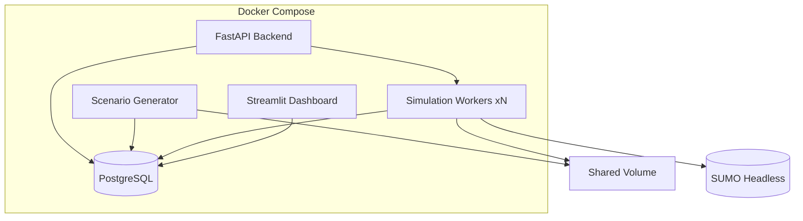
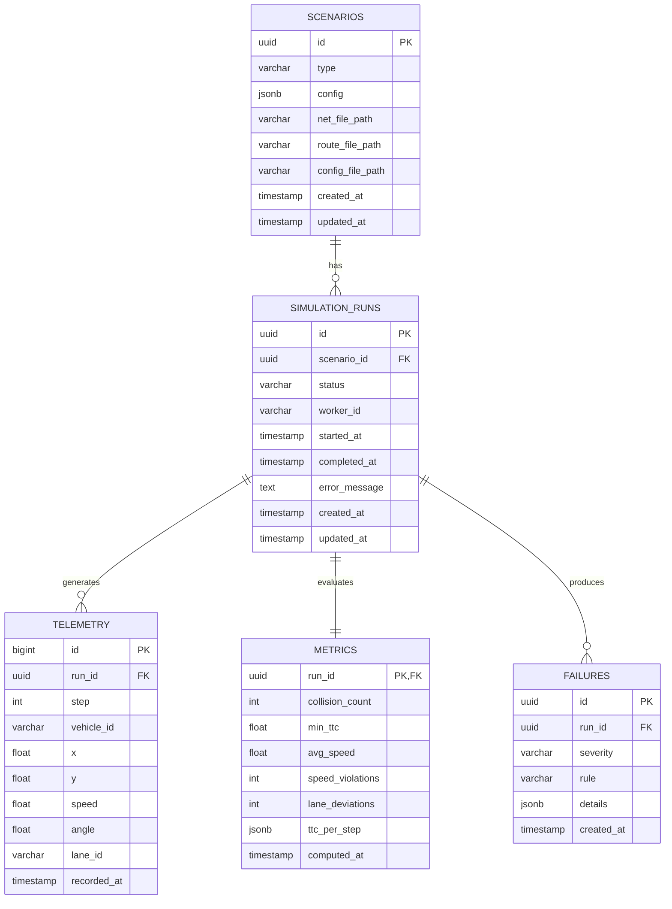

# Sopir Architecture

## System Overview



## Services

| Service | Technology | Responsibility | Scale |
|---------|------------|----------------|-------|
| **Backend (API)** | FastAPI + SQLAlchemy | REST API, job queue, results storage | 1 (stateless) |
| **Scenario Generator** | Python + Jinja2 templates | Generate SUMO artifacts from templates | Batch/on-demand |
| **Simulation Workers** | Python + TraCI + SUMO | Run headless SUMO, emit telemetry | Horizontal (N) |
| **Evaluation Engine** | Python | Compute metrics, detect failures | On-demand |
| **Dashboard** | Streamlit | Visualize runs, metrics, failures | 1 |
| **PostgreSQL** | Postgres 16 | Persistent storage for all data | 1 |

## Data Flow

### 1. Scenario Generation
```
POST /api/v1/scenarios/generate
    → scenario_gen.cli.generate_scenarios()
    → For each of 4 types (intersection, highway_merge, pedestrian_crossing, lane_change):
        - Load template .net.xml, .rou.xml from scenario_gen/templates/
        - Validate XML structure (lanes have shapes, routes have vehicles)
        - Create scenario row in DB with UUID
        - Write artifacts to /data/scenarios/{scenario_id}/
    → Returns 4 scenario IDs
```

### 2. Simulation Execution
```
POST /api/v1/runs {"scenario_id": "..."}
    → Creates SimulationRun(status="queued")
    → Worker polls DB for queued runs (SELECT ... FOR UPDATE SKIP LOCKED)
    → Worker claims run (status="running", worker_id=HOSTNAME)
    → TraCI context manager starts SUMO headless with .sumocfg
    → Simulation loop:
        - traci.simulationStep()
        - Read all vehicle positions, speeds, lanes
        - Batch telemetry every 100 steps → bulk INSERT
    → On completion: status="completed", write remaining telemetry
    → On error: status="failed", error_message set
```

### 3. Evaluation
```
POST /api/v1/metrics/runs/{run_id}/evaluate
    → Fetch all telemetry for run_id (ordered by step, vehicle_id)
    → compute_metrics(telemetry) → dict with 6 metrics + ttc_per_step
    → detect_failures(metrics) → list of failure dicts
    → Upsert Metrics row (run_id PK)
    → Delete old failures for run, insert new failures
    → Commit (does NOT touch run.status - worker owns lifecycle)
    → Returns MetricsResponse
```

### 4. Dashboard Visualization
```
GET / (Streamlit)
    → Load runs, metrics, failures, scenarios (cached 30s)
    → Render:
        - Runs table with filters (status, scenario, date)
        - Metric charts (bar charts, TTC trend line)
        - Failure list with severity/rule filters
```

## Key Technical Decisions

| Decision | Rationale |
|----------|-----------|
| **Polling workers** (not message queue) | Simpler MVP; Redis/SQS in Phase 2 |
| **Batch telemetry inserts** (100 steps) | Avoids DB bottleneck at 10Hz/vehicle |
| **Shared Docker volume** for artifacts | Simple file passing without S3/minio |
| **Stateless workers** | All state in DB; horizontal scaling trivial |
| **SUMO `--no-gui` headless** | CI-friendly, faster, no display needed |
| **SQLAlchemy + Pydantic** | Type safety, auto API docs (Swagger) |
| **UUID primary keys** | Distributed-friendly, no collisions |
| **Pure functions for metrics/failures** | Unit-testable, no DB coupling |

## Database Schema



## Failure Detection Logic

| Severity | Rule | Condition | Example |
|----------|------|-----------|---------|
| **Critical** | `collision` | `collision_count > 0` | Any vehicle overlap < 2.5m |
| **High** | `min_ttc_lt_1s` | `min_ttc < 1.0` | Close following at speed |
| **Medium** | `speed_violations_gt_10` | `speed_violations > 10` | >15 m/s for >10 timesteps |
| **Medium** | `lane_deviations_gt_5` | `lane_deviations > 5` | >5 unsignaled lane changes |

**TTC Calculation**: For each vehicle pair at same timestep:
```
distance = hypot(dx, dy)
v_rel = abs(speed1 - speed2)
ttc = distance / v_rel  (if v_rel > 0 and distance > 0)
```

## Metrics Computed

| Metric | Description |
|--------|-------------|
| `collision_count` | Vehicle pairs within 2.5m at same timestep |
| `min_ttc` | Minimum time-to-collision across all pairs/steps |
| `avg_speed` | Mean speed across all vehicles/steps |
| `speed_violations` | Timesteps where any vehicle > 15 m/s |
| `lane_deviations` | Lane changes per vehicle (any lane change counted) |
| `ttc_per_step` | Array of min TTC per simulation step (for trend chart) |

## Phase 2+ Scaling Path

| Feature | Description |
|---------|-------------|
| **Redis Queue + Celery** | Replace polling with reliable task queue |
| **S3/MinIO for Artifacts** | Replace shared volume for multi-host |
| **CloudWatch/Grafana** | Operational metrics, alerting |
| **ECS Fargate / K8s** | Serverless worker scaling |
| **Active Learning Loop** | Prioritize rare/dangerous scenarios for re-simulation |
| **LLM Failure Assistant** | Generate investigation notes from telemetry + metrics |
| **Regression Testing** | CI/CD blocks deployment on metric regressions |
| **Scenario Versioning** | Git-like scenario library with tags |
| **Horizontal Scaling** | Spot instances, cost optimization |

## Local Development

```bash
# Start all services
docker compose up --build -d

# Generate scenarios
docker compose exec backend python -m scenario_gen.cli generate

# Scale workers
docker compose up --scale worker=3 -d

# Create runs (via API or script)
# Wait for completion, then evaluate

# Open dashboard
open http://localhost:8501
```

## Configuration

All via environment variables (`.env`):
- `DATABASE_URL` - PostgreSQL connection
- `POLL_INTERVAL` - Worker poll seconds (default: 5)
- `TELEMETRY_BATCH_SIZE` - Batch insert size (default: 100)
- `SUMO_HOME` - SUMO installation path
- `SCENARIO_DATA_DIR` - Shared volume mount (default: /data/scenarios)
- `SCENARIO_TEMPLATES_DIR` - Template location (default: /app/scenario_gen/templates)